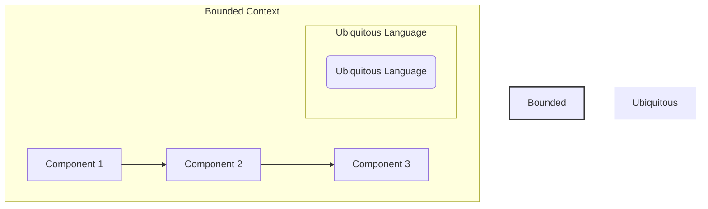
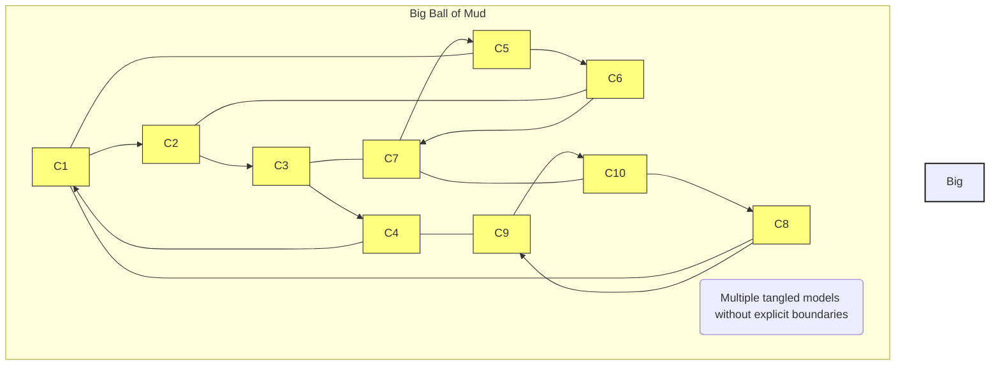
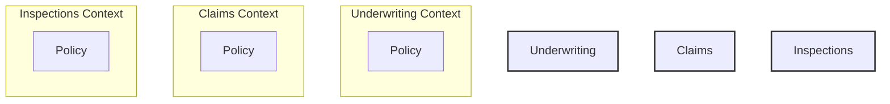
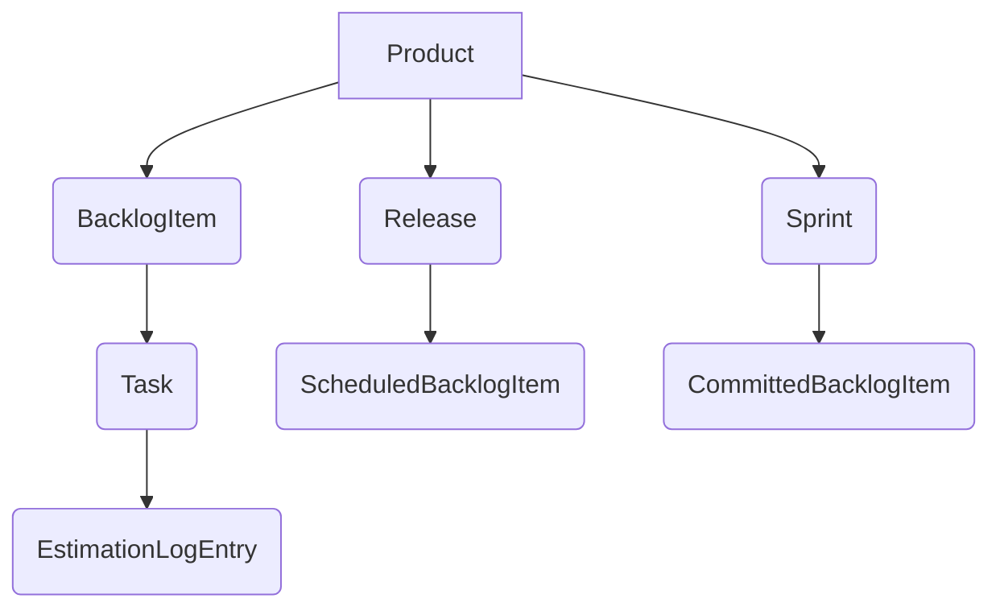
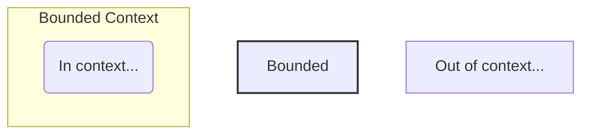

# Chapter 2: Strategic Design with Bounded Contexts and the Ubiquitous Language

This chapter introduces two cornerstone concepts of Domain-Driven Design (DDD): Bounded Contexts and the Ubiquitous Language. DDD is fundamentally about modeling a Ubiquitous Language within an explicitly defined Bounded Context.

## Bounded Context

A *Bounded Context* is a semantic contextual boundary. Within this boundary, every component of the software model has a specific meaning and performs specific actions. These components are context-specific and semantically motivated. Initially, a Bounded Context might be conceptual, representing part of your "problem space". However, as the model gains clarity, it transitions into the "solution space," reflected as project source code. A Bounded Context is where a model is implemented, and each Bounded Context should have separate software artifacts.

### Problem Space vs. Solution Space

* **Problem Space**: This is where high-level strategic analysis and design are performed within project constraints. Simple diagrams can be used to discuss high-level project drivers, goals, and risks. Context Maps and Bounded Contexts can be used here.
* **Solution Space**: This is where the solution identified in the problem space, particularly the "Core Domain," is actually implemented. Code, including main and test source, and integration support for other Bounded Contexts, is produced here.



The software model within the context boundary reflects a language developed by the team working in the Bounded Context and spoken by every member of that team. This language is called the *Ubiquitous Language* because it is both spoken among the team members and implemented in the software model. Thus, it is necessary that the Ubiquitous Language be rigorous—strict, exact, stringent, and tight.

When the Bounded Context is being developed as a key strategic initiative for an organization, it is called the *Core Domain*. A Core Domain is a software model considered among the most important because it is a means to achieve competitive greatness. It should address a major line of business. Organizations should wisely choose what should be part of their Core Domain and invest their best resources in it.

### Bounded Contexts, Teams, and Source Code Repositories

* Ideally, one team should be assigned to work on one Bounded Context.
* There should also be a separate source code repository for each Bounded Context.
* Multiple teams should *not* work on a single Bounded Context, though one team *could* work on multiple Bounded Contexts.
* Source code and database schemas should be cleanly separated for each Bounded Context, just like the Ubiquitous Language.
* Acceptance tests and unit tests should be kept together with the main source code.
* This separation ensures clear ownership and eliminates the chances of unwelcome surprises when another team makes a change to your source code.

Bounded Contexts act as "language boundaries", similar to national language borders where terminology changes meaning when crossing into a different country. Components outside a Bounded Context are not expected to adhere to the same definitions and will likely differ.

One major reason to use Bounded Contexts is to avoid the problem of piling more and more concepts into a single, unbounded domain model. This leads to blurred language because there are actually multiple languages in one large, confusing model. This uncontrolled growth can result in a *Big Ball of Mud*.

* **Big Ball of Mud**: A system with multiple tangled models without explicit boundaries. It likely requires multiple teams and contains unrelated concepts blown out over many modules and interconnected with conflicting elements. Tests in such systems are often slow and may be bypassed. This is the outcome of trying to do too much, with too many people, in the wrong place, leading to a fractured and abandoned Ubiquitous Language.



## Domain Experts and Business Drivers

A "Big Ball of Mud" often arises when software developers don't adequately listen to business experts. Business stakeholders often communicate subtle hints about where model boundaries should exist, often aligning with departmental or work group divisions. Each business function likely has different definitions for the same term.

### Example: "Policy" in Insurance

Consider the concept named "policy" and how its meaning differs across various insurance business functions:

* *Policy in Underwriting*: Created based on risk evaluation of the insured entity (e.g., assessing property risks for premium calculation).
* *Policy in Inspections*: Tracks inspection details (photos, notes) associated with a property to be insured, referenced by underwriting for final premium negotiation.
* *Policy in Claims*: Tracks payment requests by the insured based on policy terms, focusing on damages and reviews to determine payment.

Attempting to merge these three distinct "policy" types into a single model for all business groups would lead to problems and difficulty supporting future concepts. DDD emphasizes embracing these differences by segregating them into separate Bounded Contexts. Each context would have its own unique "Policy" concept, and the Bounded Context's name would provide the necessary scoping (e.g., "Underwriting Context" for its "Policy").



### Another Example: What Is a Flight?

In the airline industry, a "flight" can have multiple meanings. There's a flight defined as a single takeoff and landing, another in terms of aircraft maintenance, and yet another for passenger ticketing (nonstop or one-stop). Because each use of "flight" is clearly understood only by its context, each should be modeled in a separate Bounded Context to avoid a confusing tangle.

## Case Study (Agile Project Management Application)

An agile project management application, initially focused on "Product," "Backlog Items," "Releases," and "Sprints," with "Tasks" and "Estimation Log Entries," demonstrates a focused language.



However, the team starts adding unrelated concepts like "Users," "Tenants," and "Permissions," which have nothing to do with Scrum, leading to a fragmented and confused language. Further additions like "Forums," "Calendars," "Accounts," "Support Plans," "Payments," "Incidents," and human resource utilization concepts (e.g., "Resource Manager," "TimeConsuming Resource," "Schedule," "Availability," "Team," "Product Owner," "Team Member") further dilute the core Scrum language. This uncontrolled growth pushes the project towards becoming a "Big Ball of Mud".

## Fundamental Strategic Design Needed

To avoid such pitfalls, DDD provides two fundamental strategic design tools: *Bounded Context* and the *Ubiquitous Language*. Employing a Bounded Context forces the team to answer the question "What is core?". It should hold closely all concepts that are core to the strategic initiative and push out all others. The concepts that remain are part of the team's *Ubiquitous Language*. This approach helps DDD avoid the design of monolithic applications.

### Testing Benefits

Bounded Contexts, being non-monolithic, result in fewer, faster-running tests focused on a single model. While not the primary motivation, it is a significant benefit.



The concepts that survive this stringent application of core-only filtering are part of the Ubiquitous Language of the team that owns the Bounded Context. The boundary emphasizes the rigor inside.

### Domain Experts and Developers

Determining "what is core" requires bringing together *Domain Experts* and software *developers* into a cohesive, collaborative team.

* **Domain Experts**: Primarily focused on business concerns and their vision of how the business works. In a Scrum domain, a Scrum Master thoroughly understanding Scrum execution would be a Domain Expert. Their mental model forms the foundation of the team's Ubiquitous Language.
    * *Product Owner vs. Domain Expert*: A Scrum product owner might also be a Domain Expert, but their primary focus is often product backlog management and conceptual/technical continuity, not necessarily core business competency. It's crucial to have a true Domain Expert on the team.
* **Developers**: Focused on software development and can become consumed by programming languages and technologies. They must carefully resist being so technically centered and embrace the Ubiquitous Language developed by the team within their Bounded Context.
* **Focus on Business Complexity, Not Technical Complexity**: DDD is used because the business model complexity is high, and developers must dig into the business model with Domain Experts. The domain model should not be made more complex than necessary.

Both developers and Domain Experts should reject any tendency to allow documents to rule over conversation. The best Ubiquitous Language will be developed by a collaborative feedback loop that drives out the combined mental model of the team. Open conversation, exploration, and challenges to current knowledge lead to deeper insights about the Core Domain.

## Challenge and Unify

Returning to the out-of-control agile project management model, we challenge and unify its concepts.

* Concepts like `Tenant`, `User`, and `Permission` are **not** part of Scrum and should be factored out. They are replaced by `Team`, `ProductOwner`, and `TeamMember`, which align with the Scrum Ubiquitous Language.
* `SupportPlans` and `Payments` are clearly **not** part of Scrum project management and are removed from this model.
* Human Resource Utilization concerns (e.g., `ResourceManager`, `TimeConsumingResource`, `Schedule`, `Availability`) are probably useful but **out of context** for the core Scrum model.
* A new core concept, `Volunteer`, is added to allow `TeamMembers` to work on `Tasks`, which **is in context** with Scrum.
* Calendar-based items (e.g., `Reminders`, `Milestones`, `Planning`, `Retrospective Meetings`, `TargetDates`) are **in context** but might be saved for a later sprint (out of scope for initial development).
* Threaded `Discussions` are determined to be part of the core model and thus **in context**. However, the full collaboration suite is out of context and would be supported by integrating with another Bounded Context (a "Collaboration Context").

This rigorous process leaves a much smaller, actual Core Domain for Agile Project Management, which will grow only as new concepts adhere to the Ubiquitous Language of Scrum. Other removed concepts would likely be composed into their own respective Bounded Contexts, each with its own Ubiquitous Language, and integrated later using Context Mapping.

```mermaid
graph TD
    subgraph Agile Project Management Core
        style Agile Project Management Core fill:#add8e6,stroke:#333,stroke-width:2px
        P(Product) --> BI(BacklogItem)
        P --> R(Release)
        P --> S(Sprint)
        BI --> T(Task)
        BI --> V(Volunteer)
        T --> ELE(EstimationLogEntry)
        R --> SBI(ScheduledBacklogItem)
        S --> CBI(CommittedBacklogItem)
        P --- D(Discussion)
        Team(Team) --> PO(ProductOwner)
        Team --> TM(TeamMember)
    end

    subgraph User Management
        style User Management fill:#add8e6,stroke:#333,stroke-width:2px
        Tenant(Tenant) --> User(User)
        User --> Role(Role)
    end

    subgraph Billing & Support
        style Billing & Support fill:#add8e6,stroke:#333,stroke-width:2px
        Account(Account) --> Payment(Payment)
        SupportPlan(SupportPlan) --> Incident(Incident)
    end

    subgraph Collaboration
        style Collaboration fill:#add8e6,stroke:#333,stroke-width:2px
        Forum(Forum) --> DiscussionC(Discussion)
        Calendar(Calendar) --> CE(CalendarEntry)
        DiscussionC --> Post(Post)
    end

    subgraph Resource Management
        style Resource Management fill:#add8e6,stroke:#333,stroke-width:2px
        RM(ResourceManager) --> TCR(TimeConsumingResource)
        TCR --> Schedule(Schedule)
        TCR --> Availability(Availability)
    end

    AgileProjectManagementCore --- Collaboration
```

## Developing a Ubiquitous Language

Developing a Ubiquitous Language within a team involves more than just well-known nouns. While nouns are important, spoken language is far richer. The Core Domain should be expressed as a set of concrete scenarios about what the domain model is supposed to do. These are not just use cases or user stories, but descriptions of how the software model components work, achieved through collaboration between Domain Experts and developers.

* **Example Scenario (Scrum Context)**: "Allow each backlog item to be committed to a sprint. The backlog item may be committed only if it is already scheduled for release. If it is already committed to a different sprint, it must be uncommitted first. When the commit completes, notify interested parties".
    * This scenario describes the behavior of software model components, not human procedures. It involves nouns, verbs, adverbs, and constraints.
    * **Refinement**: Asking "who" does the committing (e.g., "The product owner commits...") and "who or what are the interested parties" (e.g., the sprint needs to track total commitment) leads to deeper insights and new model concepts (e.g., a "quorum" of team members for approval). This can also introduce the need for "eventual consistency".

### Putting Scenarios to Work

To transition written scenarios into artifacts that validate the domain model, *Specification by Example* (also called Behavior-Driven Development or BDD) can be used. This collaboratively develops and refines the Ubiquitous Language, models with shared understanding, and determines whether the model adheres to specifications by creating acceptance tests.

* **Executable Specification Example (Given/When/Then)**:
```gherkin
Scenario: The product owner commits a backlog item to a sprint
Given a backlog item that is scheduled for release
And the product owner of the backlog item
And a sprint for commitment
And a quorum of team approval for commitment
When the product owner commits the backlog item to the sprint
Then the backlog item is committed to the sprint
And the backlog item committed event is created
```

These can be executed with tools or through unit testing frameworks by creating acceptance tests. This typically follows a red-green (fail-pass) approach. These acceptance tests are directly associated with the Bounded Context and kept in its source code repository.

## What about the Long Haul?

The learning and knowledge acquisition process in DDD is continuous and does not end with "maintenance". The Ubiquitous Language must continue to evolve and thrive over years. A long-term commitment to a core initiative is crucial for it to remain a strategic differentiator (a *Core Domain*).

## Architecture

A Bounded Context is composed of more than just a domain model. Using a Ports and Adapters architecture, you can see various layers.

```mermaid
graph TD
    subgraph Bounded Context
        style Bounded Context fill:#add8e6,stroke:#333,stroke-width:2px
        subgraph Application
            style Application fill:#87ceeb,stroke:#333,stroke-width:2px
            subgraph Domain Model
                style Domain Model fill:#90ee90,stroke:#333,stroke-width:2px
                DMText("Domain Model")
            end
            AppText("Application")
        end
        Adapter1(Adapter) --x URLConnection([ (world) ])
        Adapter2(Adapter) --x Phone([ (phone) ])
        Adapter3(Adapter) --x Cloud([ (cloud) ])
        Adapter4(Adapter) --x Lightning([ (lightning) ])
        Adapter5(Adapter) --- DB([ (database) ])
        Adapter6(Adapter) --- File([ (file) ])
        Adapter7(Adapter) --- Grid([ (grid) ])
        Adapter8(Adapter) --- Lightning2([ (lightning) ])

        Adapter1 --> Application
        Adapter2 --> Application
        Adapter3 --> Application
        Adapter4 --> Application
        Adapter5 --> Application
        Adapter6 --> Application
        Adapter7 --> Application
        Adapter8 --> Application
    end
```

### Layers within a Bounded Context

* `Input Adapters`: User interface controllers, REST endpoints, message listeners.
* `Application Services`: Orchestrate use cases and manage transactions.
* `Domain Model`: The core business logic that we've been focusing on.
* `Output Adapters`: Persistence management, message senders.

```mermaid
graph LR
    IAD[Input Adapter] -- Security --> AS[Application Service]
    IAD -- User Interface Representations --> AS
    AS -- Security --> DM[Domain Model]
    AS -- Transactions --> DM
    AS -- Task Coordination --> DM
    AS -- Use Case Controller --> DM
    DM -- Entities --> OA[Output Adapter]
    DM -- Business Logic --> OA
    DM -- Domain Events --> OA
    OA -- Repositories --> DB((DB))
    OA -- Documents --> File((File))
    OA -- Cache --> Cache((Cache))
    OA -- Messaging --> MQ((Messaging))

    Lightning1([ (lightning) ]) -- Domain Events --> IAD
    URLConnection1([ (world) ]) --> IAD
    Phone1([ (phone) ]) --> IAD
    Cloud1([ (cloud) ]) --> IAD

    AS -- Persistence --> DM
    AS -- Domain Events --> MQ

    DB((DB)) --- OA
    File((File)) --- OA
    Grid((Grid)) --- OA
    Lightning2([ (lightning) ]) --- OA
```

* **Technology-Free Domain Model**: The domain model should be free of technology. For instance, transactions are managed by application services, not the domain model.

DDD can be used with various architectures and patterns, mixing and matching as needed:

* Event-Driven Architecture; Event Sourcing
* Command Query Responsibility Segregation (CQRS)
* Reactive and Actor Model
* Representational State Transfer (REST)
* Service-Oriented Architecture (SOA)
* Microservices (considered essentially equivalent to DDD Bounded Contexts)
* Cloud computing

Regarding microservices, even if a microservice models only one concept (e.g., Product or BacklogItem), both the Product microservice and the BacklogItem microservice would still logically exist within the same larger, logical Bounded Context (e.g., a Scrum-based contextual and semantic boundary). Their difference lies in deployment units and interaction patterns.

## Summary

In summary, Chapter 2 covered:

* Major pitfalls of putting too much into one model and creating a "Big Ball of Mud".
* The application of DDD strategic design.
* The use of *Bounded Context* and *Ubiquitous Language*.
* How to challenge assumptions and unify mental models.
* How to develop a *Ubiquitous Language*.
* About the architectural components found inside a Bounded Context.
* The assertion that DDD is not too difficult to put into practice yourself!

For a more in-depth treatment of Bounded Contexts, refer to Chapter 2 of *Implementing Domain-Driven Design* [IDDD].
```