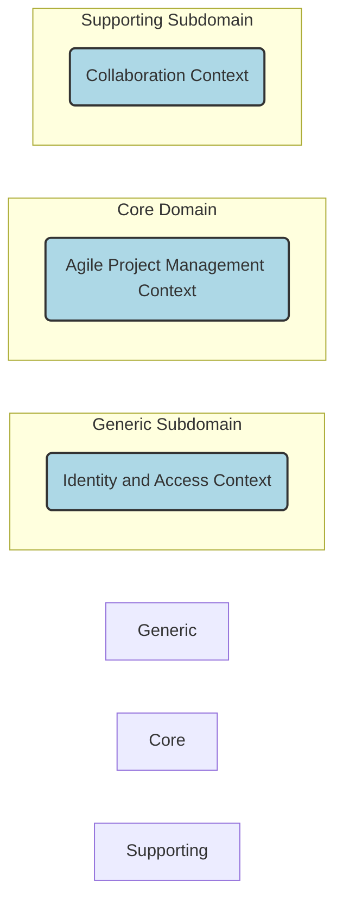

Here's a detailed summary of Chapter 3, "Strategic Design with Subdomains," in Markdown format:

# Chapter 3: Strategic Design with Subdomains

[cite\_start]When using DDD, there are always multiple *Bounded Contexts* at play[cite: 1117]. [cite\_start]One of these will be the *Core Domain*, and the others will be various *Subdomains*[cite: 1118]. [cite\_start]Chapter 2 emphasized the importance of dividing models by their specific *Ubiquitous Language* and forming multiple Bounded Contexts[cite: 1119]. [cite\_start]Ideally, a DDD strategic design achieves an optimal modeling composition: one Subdomain per Bounded Context, and one Bounded Context per Subdomain[cite: 1121]. [cite\_start]For example, the *Agile Project Management Core* can be both a clean Bounded Context and a clean Subdomain[cite: 1122]. [cite\_start]While sometimes multiple Subdomains might exist within one Bounded Context, this is not the most optimal modeling outcome[cite: 1123].

```mermaid
graph TD
    subgraph Agile Project Management Core
        style Agile Project Management Core fill:#add8e6,stroke:#333,stroke-width:2px
        P(Product) --> BI(BacklogItem)
        P --> R(Release)
        P --> S(Sprint)
        BI --> T(Task)
        BI --> V(Volunteer)
        T --> ELE(EstimationLogEntry)
        R --> SBI(ScheduledBacklogItem)
        S --> CBI(CommittedBacklogItem)
        P --- D(Discussion)
        Team(Team) --> PO(ProductOwner)
        Team --> TM(TeamMember)
    end

    subgraph User Management
        style User Management fill:#add8e6,stroke:#333,stroke-width:2px
        Tenant(Tenant) --> User(User)
        User --> Role(Role)
    end

    subgraph Billing & Support
        style Billing & Support fill:#add8e6,stroke:#333,stroke-width:2px
        Account(Account) --> Payment(Payment)
        SupportPlan(SupportPlan) --> Incident(Incident)
    end

    subgraph Collaboration
        style Collaboration fill:#add8e6,stroke:#333,stroke-width:2px
        Forum(Forum) --> DiscussionC(Discussion)
        Calendar(Calendar) --> CE(CalendarEntry)
        DiscussionC --> Post(Post)
    end

    subgraph Resource Management
        style Resource Management fill:#add8e6,stroke:#333,stroke-width:2px
        RM(ResourceManager) --> TCR(TimeConsumingResource)
        TCR --> Schedule(Schedule)
        TCR --> Availability(Availability)
    end

    AgileProjectManagementCore --- Collaboration
```

[cite\_start]*Figure: Multiple Bounded Contexts and Subdomains in an Agile Project Management example [cite: 1120]*

## What Is a Subdomain?

[cite\_start]A *Subdomain* is a sub-part of your overall business domain[cite: 1125]. [cite\_start]It represents a single, logical domain model[cite: 1126]. [cite\_start]Most business domains are too large and complex to reason about as a whole, so Subdomains are used to focus on specific parts relevant to a project[cite: 1127]. [cite\_start]Subdomains help logically break up your business domain to understand your problem space on large, complex projects[cite: 1128].

[cite\_start]Another way to think of a Subdomain is as a clear area of expertise responsible for providing a solution to a core business area[cite: 1129]. [cite\_start]This implies the presence of one or more *Domain Experts* who deeply understand the aspects of the business that a specific Subdomain facilitates[cite: 1130]. [cite\_start]Subdomains also hold varying levels of strategic significance to your business[cite: 1131]. [cite\_start]Ideally, a Subdomain would be implemented as a clean Bounded Context, with specializing Domain Experts as part of the development team[cite: 1132, 1133, 1134].

## Types of Subdomains

[cite\_start]There are three primary types of Subdomains within a project[cite: 1136]:

  * [cite\_start]**Core Domain**: This is where a strategic investment is made in a single, well-defined domain model[cite: 1137]. [cite\_start]Significant resources are committed to carefully crafting its *Ubiquitous Language* within an explicit *Bounded Context*[cite: 1137]. [cite\_start]This is a top priority project for the organization because it will distinguish it from competitors[cite: 1138]. [cite\_start]Since an organization cannot excel at everything, the Core Domain demarcates where it *must* excel[cite: 1139]. [cite\_start]Achieving deep learning and understanding for this requires commitment, collaboration, and experimentation[cite: 1140]. [cite\_start]It's where an organization should invest most liberally in software[cite: 1141].
  * [cite\_start]**Supporting Subdomain**: This type of modeling calls for custom development because an off-the-shelf solution does not exist[cite: 1143]. [cite\_start]However, it does not warrant the same level of investment as a Core Domain[cite: 1144]. [cite\_start]Outsourcing this kind of Bounded Context can be considered to avoid mistakenly over-investing in something not strategically distinguishing[cite: 1145]. [cite\_start]Despite less investment, it is still an important software model because the Core Domain's success depends on it[cite: 1146].
  * [cite\_start]**Generic Subdomain**: Solutions for this kind of subdomain may be available off the shelf, outsourced, or developed in-house by a team without the elite developers assigned to a Core or even a Supporting Subdomain[cite: 1147]. [cite\_start]It is crucial not to mistake a Generic Subdomain for a Core Domain, as it should not receive that level of investment[cite: 1148, 1149].

[cite\_start]When discussing a project employing DDD, the conversation is most likely centered around a Core Domain[cite: 1150].

## Dealing with Complexity

[cite\_start]Some system boundaries within a business domain will inevitably be *legacy systems*, whether created internally or purchased[cite: 1152]. [cite\_start]While improving these legacy systems may not be possible, it's still necessary to reason about them when they impact your Core Domain project[cite: 1153]. [cite\_start]Subdomains serve as a tool for discussing your problem space in such situations[cite: 1154].

[cite\_start]Unfortunately, many legacy systems are counter to the DDD approach of designing with Bounded Contexts and can be considered "unbounded legacy systems"[cite: 1155]. [cite\_start]This is because such a legacy system is essentially a *Big Ball of Mud*, full of multiple tangled models that should have been separately designed but were jumbled together into a complex and intertwined mess[cite: 1156, 1157].

```mermaid
graph TD
    subgraph Big Ball of Mud (Legacy System)
        style Big Ball of Mud (Legacy System) fill:#ffb380,stroke:#333,stroke-width:2px
        subgraph Accounts Subdomain
            style Accounts Subdomain border-style: dashed;
            A1[Account C1] --> A2[Account C2]
            A2 --> A3[Account C3]
        end
        subgraph Orders Subdomain
            style Orders Subdomain border-style: dashed;
            O1[Order S1] --> O2[Order S2]
            O2 --> O3[Order S3]
        end
        subgraph Catalog Subdomain
            style Catalog Subdomain border-style: dashed;
            Cat1[Catalog Item 1] --> Cat2[Catalog Item 2]
            Cat2 --> Cat3[Catalog Item 3]
        end
        subgraph Fulfillment Subdomain
            style Fulfillment Subdomain border-style: dashed;
            F1[Fulfillment A] --> F2[Fulfillment B]
            F2 --> F3[Fulfillment C]
        end
        subgraph Shipping Subdomain
            style Shipping Subdomain border-style: dashed;
            S1[Shipping X] --> S2[Shipping Y]
            S2 --> S3[Shipping Z]
        end
        A1 --- O1
        Cat1 --- O1
        O1 --- F1
        F1 --- S1
    end
```

[cite\_start]*Figure: A legacy system treated as multiple logical Subdomains [cite: 1165]*

[cite\_start]When discussing a legacy system, there are likely many logical domain models within it[cite: 1163]. [cite\_start]Each of these logical domain models can be thought of as a Subdomain[cite: 1164]. [cite\_start]Treating logical Subdomains as such helps in grappling with the complexity of large systems[cite: 1166]. [cite\_start]This allows reasoning about the problem space as if it had been developed using DDD and multiple Bounded Contexts, making the legacy system seem less monolithic and muddy when considering integration[cite: 1167, 1168, 1169]. [cite\_start]Using this tool, one can determine which Subdomains are more valuable or necessary for the current project and which can be relegated to lesser status[cite: 1170, 1171]. [cite\_start]You can even depict your Core Domain alongside these Subdomains to understand associations and dependencies[cite: 1172, 1173].



[cite\_start]*Figure: Aligning Bounded Contexts with Subdomains [cite: 1175]*

[cite\_start]When employing DDD, a Bounded Context should ideally align one-to-one (1:1) with a single Subdomain[cite: 1181, 1182]. [cite\_start]While not always possible or practical, designing in this manner keeps Bounded Contexts clean and focused on the core strategic initiative[cite: 1183, 1184]. [cite\_start]If a second model must be created within the same Bounded Context (e.g., within your Core Domain), it should be segregated using a completely separate *Module*[cite: 1185, 1186]. [cite\_start](A DDD Module is typically a package in Scala/Java or a namespace in F\#/C\#)[cite: 1186]. [cite\_start]This clearly states that one model is core and the other is merely supporting, a tactic applied in the solution space[cite: 1186, 1187].

## Summary

In this chapter, you learned:

  * [cite\_start]What Subdomains are and how they are used in both the problem space and the solution space[cite: 1190].
  * [cite\_start]The differences between a Core Domain, a Supporting Subdomain, and a Generic Subdomain[cite: 1191].
  * [cite\_start]How to utilize Subdomains when reasoning about integration with a "Big Ball of Mud" legacy system[cite: 1191].
  * [cite\_start]The importance of aligning your DDD Bounded Context one-to-one with a single Subdomain[cite: 1192].
  * [cite\_start]How to segregate a Supporting Subdomain model from your Core Domain model using a DDD Module when a full separation into different Bounded Contexts is impractical[cite: 1192].

[cite\_start]For exhaustive coverage of Subdomains, refer to Chapter 2 of *Implementing Domain-Driven Design* [IDDD][cite: 1193].

```
```
